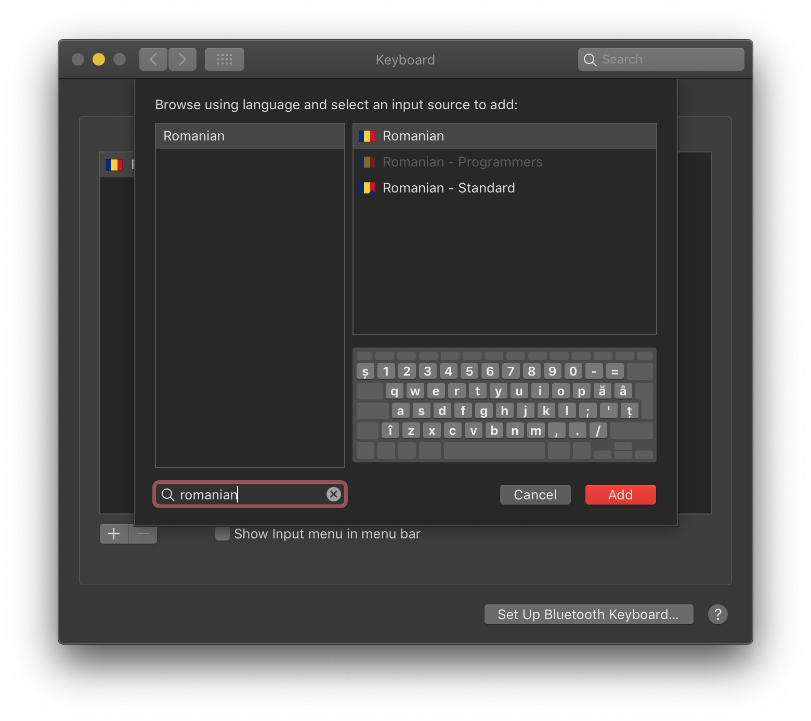
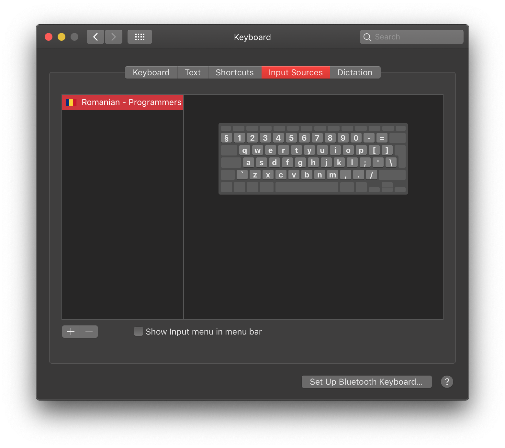
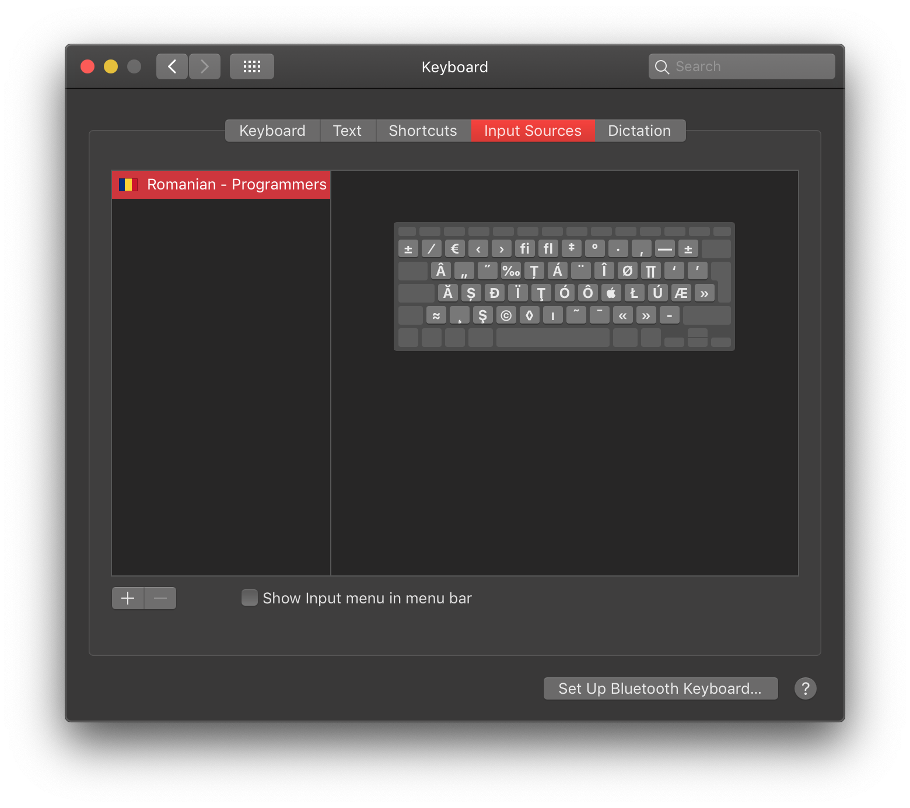

# Romanian - Programmers, a macOS Keyboard Layout

Romanian - Programmers allows easy input of Romanian diacritics using the `alt` key:

* `alt+a` -> `ă`
* `alt+q` -> `â`
* `alt+i` -> `î`
* `alt+s` -> `ș`
* `alt+t` -> `ț`

This macOS keyboard layout has popped up on the internet before, I have only changed its definition and created an iconset with a Romanian flag, so it's in line with the other Romanian layouts. 

## Installation

To install this keyboard layout you need to move the `Romanian - Programmers.bundle` file to `/Library/Keyboard Layouts/`

```bash
curl -L https://github.com/calini/romanian-programmers-macos/releases/latest/download/Romanian.-.Programmers.bundle.zip | sudo tar xvz -C /Library/Keyboard\ Layouts/
```

## Screenshots

It shows up under the Romanian section, like the default ones.

This is the keyboard layout:

While holding `option`:

While holding `option+shift`:

